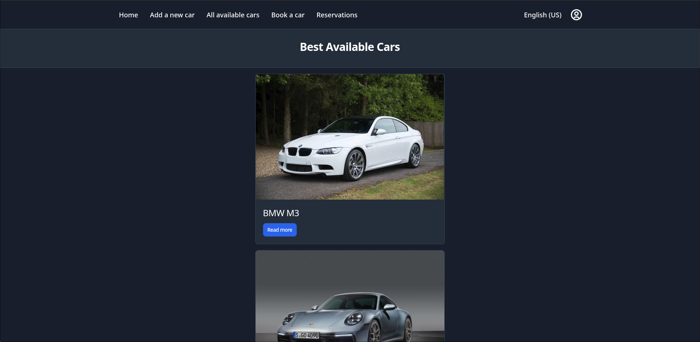
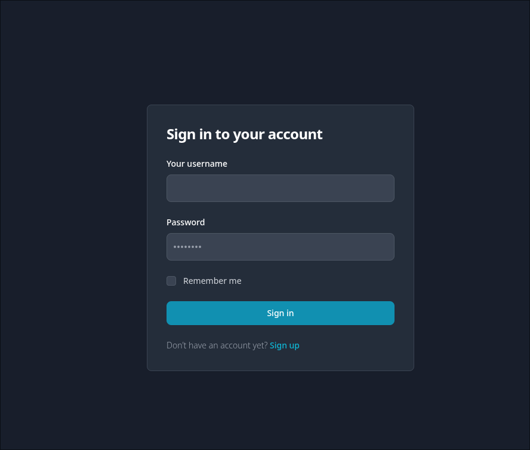
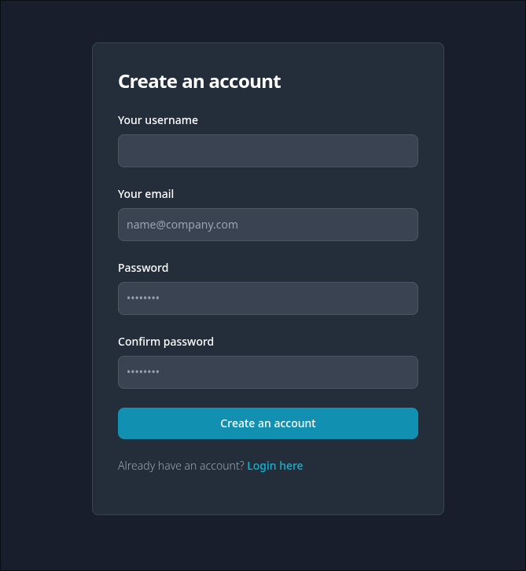
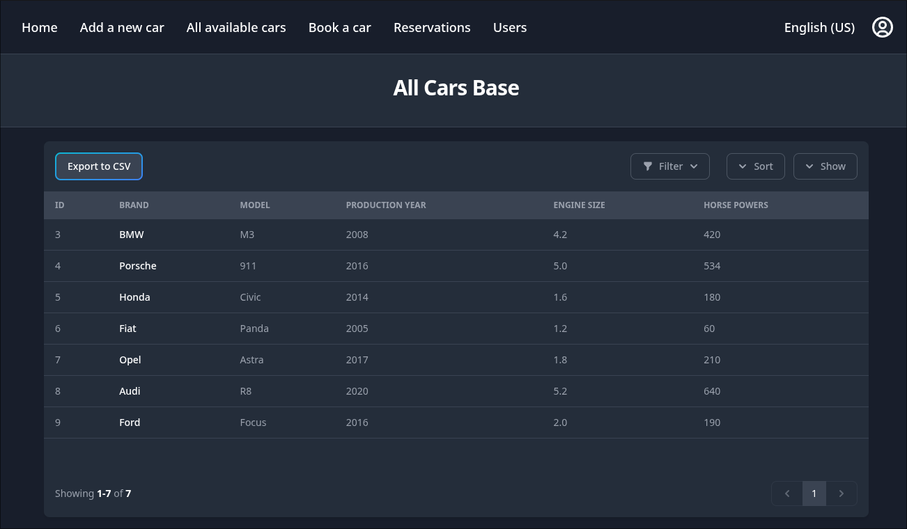

# Car Booking application
Web application for car renting, built with Spring Boot and Thymeleaf.
Application server and database are containerized, making deployment simple on any computer with Docker installed.

## About
Main purpose of the project was to learn Sping Boot framework. Including functionalities like users authentication and authorization, using JPA to integrate with Database and making test with Junit5 library.

## Features
- User registration and Logging
- Browse available cars for rent
- Reserve a car for specified time periods
- Add new cars to the system
- Delete, block/unblock users
- Modify existing cars, reservations and users
- Support for 2 languages: Polish and English

## Technologies

### Backend
- **Java 17**
- **Spring Boot 3.5.6**
- **Spring Security** - Authentication and Authorization
- **Spring Data JPA - Data access layer**
- **Hibernate** - ORM
- **PostgreSQL** - Database
- **Maven** - Build tool
- **Lombok** - Code simplication
- **Docker** - Containerization

### FrontEnd
- **Thymeleaf** - Template engine
- **TailwindCss** - CSS framework
- **Flowbite** - UI components library

## Requirements to run
- Docker Engine 20.10.0+
- Docker Compose 1.29.0+

# How to run 
## 1. **Close repository to your local computer:**
```bash
   git clone https://github.com/filipt11/CarProject.git
```

## 2. **Navigate to project directory:**
```bash
   cd CarProject
```

## 3. **Run with Docker Compose:**
```bash
   docker-compose up --build
```

## 4. Open in browser: 
```
   http://localhost:8080
```

You should see the home page:




### Default users

- username: `admin`, password: `123`
- username: `testuser`, password: `123`

## Important URLs

- **Login:** http://localhost:8080/authentication/login
- **Registration** http://localhost:8080/registrationForm

## Screenshots

### Login Page


### Registration Page


### Car Listing


### Adding New Car


### User management (Admin only)


## Testing
## Application test were prepared using Junit5 library. Tests focus on the business layer with **90%** line coverage of services.  

Run tests with:
```bash
mvn test
```

## Author

**Filip Terzyk**

- Email: filip.tezryk@gmail.com
- LinkedIn: https://www.linkedin.com/in/filip-terzyk-9b4553287/